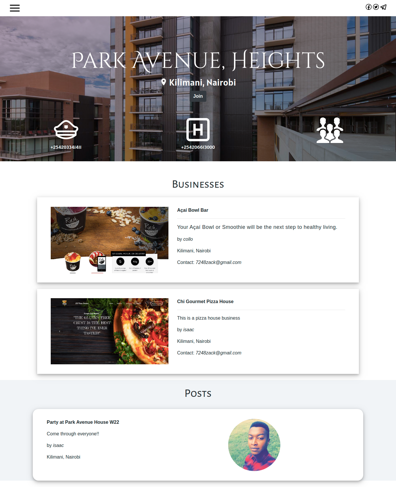

### Author
 **[Isaac Gichuru.](https://github.com/Isaacg94) 30/11/2019.**

## Description

A Private Network for Your Neighborhood.

## Features
* Users create an account.
* Users can log in to application and view available Neighborhoods once they have an account.
* Users can navigate to and view a neighborhood and it's details including business posts as well as an option to join.
* Users can create business posts.
* Users can use the navigation bar to navigate to the home page, profile page as well, login as well as logout.

**[Live-Link to site.](https://linkapp-by-isaac.herokuapp.com/)**

<!-- # Specifications

## BDD
| Behavior            | Input                         | Output                        |
| ------------------- | ----------------------------- | ----------------------------- |
| Users can sign up for an account | Input credentials in the registration form then click Sign Up | Users are prompted to login into their account |
| Users can view projects posted by other users | Click on a specific project's review button | When clicked, users are navigated to another page where they can post a review of the project |
| Users can view the full live site of a posted project | Click on the 'Go to Site' button | Users are directed to the live site of the posted project |
| Users can view and edit their profiles | Click on profile in the side navigation | Users are directed to their profile page with their posted projects displayed as well as their profile information and an option to edit it |
| Users can search projects | Click on the search icon on the navigation bar, type in a given project-title and press Enter | User will be able to view projects with that title | -->

## Setup/Installation Requirements
Here is a run through of how to set up the application:
* Step 1 : Clone this repository using the git clone link:
  * **`git clone https://github.com/Isaacg94/Neighbourhood-Watch.git`**
* Step 2 : Navigate to the directory:
  * **`cd Neighbourhood-Watch-master`**
* Step 3 : Open the directory created with your favorite IDE. If Atom type **`atom .`** if VSCode type **`code .`** . This will lauch the editor with the project setup,
* Now feel free to hack around the project.

## Known Bugs
* None currently.

## Technologies Used

- Python 3.6.8
- Django MVC framework
- HTML, CSS and Bootstrap
- Postgressql
- Heroku

## Support and contact details

Primary E-mail Address: 7248zack@gmail.com

### License
*MIT License* 

Copyright (c) 2019 **Isaac Gichuru**